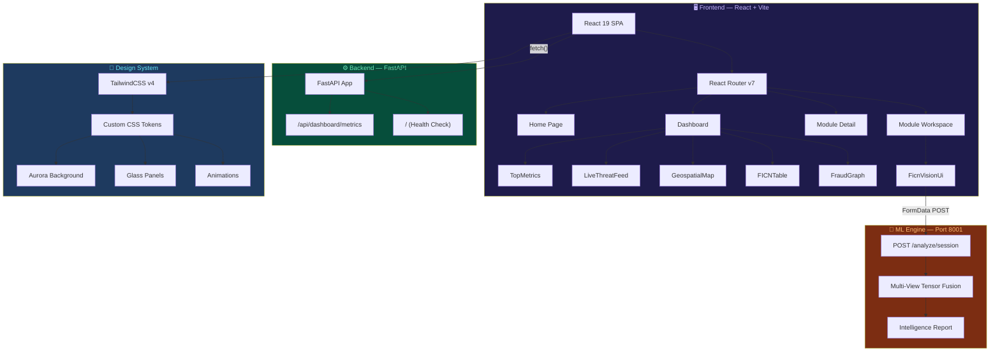
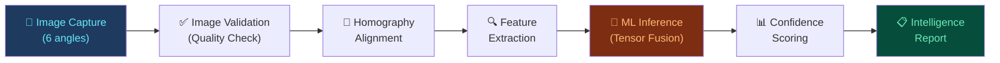
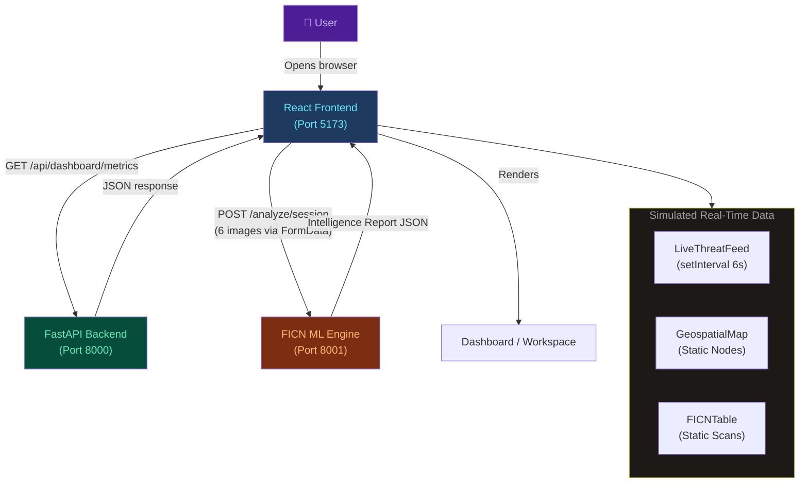
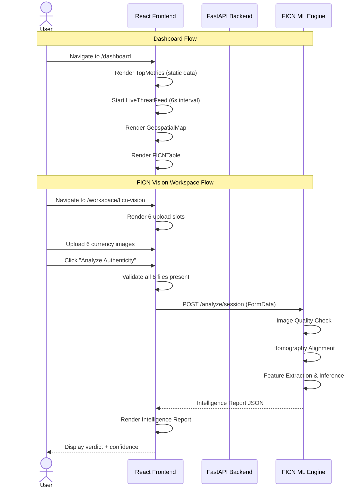

<div align="center">

<!-- Banner -->


# DRISHTI

### 🛡️ AI-Powered Holistic Security Shield for Digital Public Safety

[](LICENSE)
[](https://react.dev)
[](https://vitejs.dev)
[](https://fastapi.tiangolo.com)
[](https://tailwindcss.com)
[](https://threejs.org)
[](CONTRIBUTING.md)


---

**Predictive Intelligence for Digital Public Safety.**

Equipping law enforcement and financial institutions with real-time threat detection,
counterfeit currency interception, and fraud network visualization.

[🚀 Live Demo](#usage) · [📖 Documentation](#architecture) · [🐛 Report Bug](../../issues) · [✨ Request Feature](../../issues)

</div>

---

## 📋 Table of Contents

- [Overview](#-overview)
- [Features](#-features)
- [Screenshots](#-screenshots)
- [Architecture](#-architecture)
- [Folder Structure](#-folder-structure)
- [Tech Stack](#-tech-stack)
- [Installation](#-installation)
- [Environment Variables](#-environment-variables)
- [Usage](#-usage)
- [API Documentation](#-api-documentation)
- [Computer Vision Pipeline](#-computer-vision-pipeline)
- [Data Flow](#-data-flow)
- [Sequence Diagram](#-sequence-diagram)
- [Security](#-security)
- [Performance](#-performance)
- [Error Handling](#-error-handling)
- [Testing](#-testing)
- [Deployment](#-deployment)
- [Roadmap](#-roadmap)
- [Future Improvements](#-future-improvements)
- [FAQ](#-faq)
- [Troubleshooting](#-troubleshooting)
- [Contributing](#-contributing)
- [License](#-license)
- [Credits](#-credits)
- [Acknowledgements](#-acknowledgements)
- [Contact](#-contact)

---

## 🌐 Overview

### Problem Statement

India recorded **1.14 million+ cybercrime complaints** in 2023 alone — a staggering 60% year-over-year increase. Digital arrest scams have defrauded citizens of **₹1,776 Crore** in just 9 months through sophisticated psychological hostage scenarios. Meanwhile, Fake Indian Currency Notes (FICN) continue to infiltrate the financial system through POS terminals, ATMs, and bank counters.

### Solution

**DRISHTI** (Digital Risk Intelligence & Security Holistic Threat Interceptor) is a unified AI-powered platform that shifts law enforcement and financial institutions from **reactive investigation to predictive threat neutralisation**. It provides:

- **Real-time threat monitoring** through a live command center dashboard
- **Computer vision-based counterfeit detection** with sub-second processing
- **Fraud network graph intelligence** for cross-jurisdictional mapping
- **Citizen-facing fraud risk assessment** in 12 regional languages

### Key Idea

A single, extensible platform that combines **Agentic AI**, **Computer Vision**, **Graph Intelligence**, and **Geospatial Analytics** into a deployable system for national-scale digital safety operations.

### Target Users

| Audience | Use Case |
|---|---|
| **MHA Agencies** | Real-time digital arrest scam interception |
| **RBI Affiliates** | Counterfeit currency detection at scale |
| **Telecom Providers** | Spoofed number and VOIP fraud flagging |
| **Law Enforcement** | Cross-jurisdictional fraud network mapping |
| **Citizens** | Self-service fraud risk assessment |

### Real-World Applications

- Intercepting digital arrest scam calls before financial transfer
- Detecting counterfeit ₹500 notes at bank counting machines and POS terminals
- Mapping money mule networks across states for court-admissible intelligence
- Providing multilingual fraud guidance to citizens via WhatsApp and IVR

---

## ✨ Features

### 🤖 AI & Intelligence Modules

| Module | Description | Status |
|---|---|---|
| **FICN Vision Agent** | Computer vision architecture for mobile devices, bank counters, and POS terminals. Identifies counterfeit notes via microprint and UV feature analysis. | `Active Prototype` |
| **Fraud Graph Intelligence** | Graph AI agent that clusters victim reports, scammer infrastructure, and money mule networks across jurisdictions. | `Active Workspace` |
| **Citizen Fraud Shield** | Web-based AI console for real-time fraud risk assessment using dual Gemini AI + deterministic rule engines. | `Active Workspace` |
| **Phishing & SMS Scanner** | Forensic analysis of suspicious URLs, SMS texts, and emails against 500+ phishing signatures. | `Active Workspace` |

### 📊 Command Center Dashboard

- **Top Metrics Panel** — Active scams prevented, counterfeit value intercepted, high-risk hostage alerts
- **Live Threat Feed** — Real-time streaming threat alerts with severity classification (Critical / Warning / Alert)
- **Geospatial Intelligence Map** — Interactive dark-mode map with clickable threat nodes, IP tracing, and threat levels
- **FICN Currency Scan Table** — Recent counterfeit scan results with serial numbers, scan source, and AI confidence scores
- **Fraud Graph Network** — SVG-based interactive graph showing scam call centers, spoofed numbers, mule accounts, and crypto exits
- **Tab-Based Views** — Overview, Geospatial Map, and Graph Network views with animated transitions

### 🎨 UI & Experience

- **Aurora Background System** — GPU-accelerated animated gradient blobs with `framer-motion`
- **Responsive Navigation** — Smart hide-on-scroll navbar with dropdown module navigation and profile menu
- **Staggered Animations** — CSS keyframe-based `fadeInUp` entrance animations with configurable delays
- **Design System** — Custom CSS tokens, glass panels, gradient text, and frosted glass effects
- **Professional Typography** — Geist, Sora, and JetBrains Mono via Google Fonts
- **Dark Footer** — System status indicator with operational pulse animation

### 🔬 FICN Vision Workspace

- **Multi-Angle Upload** — 6 image captures required (Front/Back at 0°, 20°, 45° tilt)
- **Backend Integration** — FormData POST to Python ML engine at `localhost:8001`
- **Intelligence Report** — AI verdict, OCR serial extraction, image quality checks, homography alignment, model confidence
- **Threat Level Classification** — Critical / Safe with color-coded output panels

### 🗺️ Module Documentation Pages

- **Dynamic Routing** — `/module/:id` routes with parameter-driven content
- **Breadcrumb Navigation** — Home → Modules → Module Name
- **Capability Cards** — Per-module feature grids
- **Architecture Placeholder** — Ready for technical diagrams per module
- **Cross-Module Navigation** — Bottom section linking to all other modules

### ⚡ Backend API

- **FastAPI Server** — Python backend with CORS middleware
- **Dashboard Metrics Endpoint** — `GET /api/dashboard/metrics` returning operational KPIs
- **Health Check** — `GET /` root endpoint for service status verification

---

## 📸 Screenshots

> **Note:** Replace these placeholders with actual screenshots after deployment.

| View | Screenshot |
|---|---|
| Landing Page | `docs/images/home.png` |
| Dashboard Overview | `docs/images/dashboard.png` |
| Geospatial Map | `docs/images/geospatial-map.png` |
| Fraud Graph Network | `docs/images/fraud-graph.png` |
| FICN Vision Workspace | `docs/images/ficn-workspace.png` |
| Module Detail Page | `docs/images/module-detail.png` |
| Live Threat Feed | `docs/images/threat-feed.png` |
| Mobile Responsive | `docs/images/mobile.png` |

---

## 🏗️ Architecture

DRISHTI follows a **decoupled frontend-backend architecture** with a React SPA communicating with Python microservices.



### Layer Breakdown

| Layer | Technology | Responsibility |
|---|---|---|
| **Frontend** | React 19, React Router v7 | SPA rendering, routing, state management |
| **Styling** | TailwindCSS v4, Custom CSS | Design system, animations, responsive layout |
| **3D/Graphics** | Three.js, React Three Fiber | 3D rendering capabilities (available, not yet integrated) |
| **Animations** | Framer Motion, CSS Keyframes | Aurora backgrounds, threat feed transitions |
| **Backend API** | FastAPI, Uvicorn | REST endpoints, CORS, dashboard metrics |
| **ML Engine** | Python (Port 8001) | FICN computer vision inference pipeline |
| **Build Tool** | Vite 8 | HMR, bundling, TailwindCSS plugin |

---

## 📁 Folder Structure

```
drishti/
├── backend/                          # Python FastAPI backend
│   ├── api/                          # Route handlers (phishing, citizen_shield)
│   ├── core/                         # AI & analysis engines
│   ├── secrets/                      # Secure storage for Firebase JSON
│   ├── main.py                       # FastAPI app with CORS & API endpoints
│   └── __pycache__/                  # Python bytecode cache
├── public/                           # Static public assets
│   ├── favicon.svg                   # Browser tab icon
│   └── icons.svg                     # SVG icon sprite
│
├── src/                              # React application source
│   ├── main.jsx                      # React DOM entry point
│   ├── App.jsx                       # Root component with routing
│   ├── App.css                       # App-specific styles (minimal)
│   ├── index.css                     # Global design system (630 lines)
│   │
│   ├── assets/                       # Static assets bundled by Vite
│   │   ├── logo.png                  # DRISHTI brand logo
│   │   ├── react.svg                 # React logo
│   │   └── vite.svg                  # Vite logo
│   │
│   ├── pages/                        # Route-level page components
│   │   ├── Home.jsx                  # Landing page (Hero + Stats + Modules)
│   │   ├── Dashboard.jsx             # Command center with tabbed views
│   │   ├── ModuleDetail.jsx          # Per-module documentation page
│   │   └── ModuleWorkspace.jsx       # Live testing workspace router
│   │
│   └── components/                   # Reusable UI components
│       ├── HomeComponents/
│       │   ├── AuroraBackground.jsx  # GPU-accelerated gradient animation
│       │   ├── Hero.jsx              # Landing hero section with CTAs
│       │   ├── StatsPanel.jsx        # Threat landscape statistics
│       │   ├── CoreModules.jsx       # Module showcase with feature lists
│       │   ├── Navbar.jsx            # Smart hide-on-scroll navigation
│       │   └── Footer.jsx            # Dark footer with status indicator
│       │
│       ├── DashboardComponents/
│       │   ├── DashboardHeader.jsx   # Header with live status & tab bar
│       │   ├── TopMetrics.jsx        # KPI metric cards
│       │   ├── LiveThreatFeed.jsx    # Real-time simulated threat stream
│       │   ├── GeospatialMap.jsx     # Interactive India threat map
│       │   ├── FICNTable.jsx         # Currency scan results table
│       │   └── FraudGraph.jsx        # SVG fraud network visualization
│       │
│       └── ModuleComponents/
│           └── FicnVisionUi.jsx      # Multi-angle upload & ML inference UI
│
├── dist/                             # Production build output
├── index.html                        # HTML entry point with meta/SEO
├── package.json                      # Node.js dependencies & scripts
├── package-lock.json                 # Lockfile for deterministic installs
├── vite.config.js                    # Vite configuration with plugins
├── eslint.config.js                  # ESLint flat config for React
├── requirements.txt                  # Python/Node dependency reference
└── .gitignore                        # Git ignored files & directories
```

---

## 🛠️ Tech Stack

### Languages & Frameworks

| Category | Technology | Version | Purpose |
|---|---|---|---|
| **Frontend** | React | `19.2.7` | Component-based UI |
| **Routing** | React Router DOM | `7.18.0` | Client-side SPA routing |
| **Backend** | FastAPI | `latest` | Python REST API server |
| **Build** | Vite | `8.1.0` | Dev server & bundler |
| **Styling** | TailwindCSS | `4.3.1` | Utility-first CSS |

### Libraries & Tools

| Category | Technology | Version | Purpose |
|---|---|---|---|
| **3D Graphics** | Three.js | `0.185.0` | WebGL 3D rendering |
| **3D React** | React Three Fiber | `9.6.1` | React renderer for Three.js |
| **3D Helpers** | React Three Drei | `10.7.7` | Useful Three.js abstractions |
| **Animation** | Framer Motion | `12.42.2` | Motion animations & transitions |
| **Particles** | tsparticles/react | `4.2.1` | Particle effect system |
| **Linting** | ESLint | `10.5.0` | Code quality enforcement |

### Design & Typography

| Font | Usage |
|---|---|
| **Geist** | Primary body text |
| **Sora** | Headlines & display text |
| **JetBrains Mono** | Code, serial numbers, monospace data |
| **Material Symbols** | Icon system |

---

## 🚀 Installation

### Prerequisites

- **Node.js** ≥ 18.x
- **npm** ≥ 9.x
- **Python** ≥ 3.9 (for backend)
- **pip** (for Python packages)
- **Git**

### 1. Clone the Repository

```bash
git clone https://github.com/your-username/drishti.git
cd drishti
```

### 2. Frontend Setup

```bash
# Install Node.js dependencies
npm install

# Start the development server
npm run dev
```

The frontend will be available at `http://localhost:5173`.

### 3. Backend Setup

```bash
# Install Python dependencies
pip install fastapi uvicorn

# Start the FastAPI server
cd backend
uvicorn main:app --reload --port 8000
```

The backend API will be available at `http://localhost:8000`.

### 4. ML Engine (FICN Vision)

> [!IMPORTANT]
> The FICN Vision ML engine runs on a separate service (Port 8001). Ensure the engine is running before using the FICN Vision workspace.

```bash
# Navigate to your ML engine directory (separate repository)
# Start the ML inference server
uvicorn ficn_engine:app --reload --port 8001
```

### 5. Production Build

```bash
# Build optimized production bundle
npm run build

# Preview the production build locally
npm run preview
```

---

## 🔐 Environment Variables

> [!NOTE]
> The current codebase uses hardcoded URLs for development simplicity. Below are the variables recommended for production configuration.

### Frontend (.env)
| Variable | Description | Required | Default / Example |
|---|---|---|---|
| `VITE_API_BASE_URL` | FastAPI backend URL | Recommended | `http://localhost:8000` |
| `VITE_ML_ENGINE_URL` | FICN Vision ML engine URL | Recommended | `http://127.0.0.1:8001` |
| `VITE_APP_TITLE` | Application display title | Optional | `DRISHTI` |

<details>
<summary>📝 Example <code>.env</code> file</summary>

```env
# API Configuration
VITE_API_BASE_URL=http://localhost:8000
VITE_ML_ENGINE_URL=http://127.0.0.1:8001

# Application
VITE_APP_TITLE=DRISHTI
```

</details>

> **Recommended Future Enhancement:** Migrate hardcoded URLs in `FicnVisionUi.jsx` and other components to use environment variables via `import.meta.env`.

---

## 📖 Usage

### Landing Page

Navigate to `http://localhost:5173/` to access the landing page featuring:
1. **Hero Section** with animated aurora background
2. **Threat Landscape Statistics** pulled from MHA/RBI reports
3. **Core Intelligence Modules** with detailed feature breakdowns

### Command Center Dashboard

Navigate to `/dashboard` to access the operational command center:

1. **Overview Tab** — Top metrics + live threat feed + geospatial map + FICN scan table
2. **Geospatial Map Tab** — Full-screen interactive threat node map
3. **Graph Network Tab** — Fraud network graph visualization

### Module Documentation

Navigate to `/module/<module-id>` to view detailed documentation for each module:

- `/module/ficn-vision`
- `/module/fraud-graph`
- `/module/citizen-shield`

### FICN Vision Workspace

Navigate to `/workspace/ficn-vision` to use the live counterfeit detection workspace:

1. Upload 6 currency note images (Front/Back at 0°, 20°, 45° angles)
2. Click **"Analyze Authenticity"** to send images to the ML engine
3. View the Intelligence Report with AI verdict, OCR serial, and confidence scores

---

## 📡 API Documentation

### Backend API — FastAPI (Port 8000)

| Endpoint | Method | Description | Parameters | Response |
|---|---|---|---|---|
| `/` | `GET` | Health check / service status | None | `{ "status": "DRISHTI Backend is running live!" }` |
| `/api/dashboard/metrics` | `GET` | Dashboard operational KPIs | None | See response below |

<details>
<summary>📦 <code>GET /api/dashboard/metrics</code> — Response Schema</summary>

```json
{
  "scamsPrevented": 142,
  "counterfeitIntercepted": "₹8.4L",
  "highRiskAlerts": 3
}
```

</details>

### ML Engine API (Port 8001)

| Endpoint | Method | Description | Parameters | Response |
|---|---|---|---|---|
| `/analyze/session` | `POST` | Multi-view currency analysis | `FormData` with 6 image files | Intelligence Report JSON |

<details>
<summary>📦 <code>POST /analyze/session</code> — Request & Response</summary>

**Request:** `multipart/form-data`

| Field | Type | Description |
|---|---|---|
| `front_0` | `File` | Front face at 0° (flat) |
| `front_20` | `File` | Front face at 20° tilt |
| `front_45` | `File` | Front face at 45° tilt |
| `back_0` | `File` | Back face at 0° (flat) |
| `back_20` | `File` | Back face at 20° tilt |
| `back_45` | `File` | Back face at 45° tilt |

**Response:**

```json
{
  "source_service": "ficn-vision-engine",
  "threat_level": "CRITICAL",
  "payload": {
    "status_verdict": "COUNTERFEIT DETECTED",
    "detected_serial": "8AC 493021",
    "overall_confidence": 97.4,
    "checks": {
      "image_quality": "PASS",
      "alignment_homography": "ALIGNED"
    }
  }
}
```

</details>

---

## 🔬 Computer Vision Pipeline

The FICN Vision Agent follows a **multi-view tensor fusion** architecture:



| Stage | Description |
|---|---|
| **Image Capture** | 6 photos captured at 3 angles (0°, 20°, 45°) for both front and back faces |
| **Image Validation** | Quality assessment to ensure adequate resolution and lighting |
| **Homography Alignment** | Perspective correction to normalize all views to a canonical plane |
| **Feature Extraction** | Microprint verification, security thread analysis, serial number OCR |
| **ML Inference** | Multi-view tensor fusion model produces authenticity classification |
| **Confidence Scoring** | Numerical confidence percentage for the classification decision |
| **Intelligence Report** | Structured JSON output with verdict, serial, checks, and threat level |

---

## 🔄 Data Flow



---

## 🔀 Sequence Diagram



---

## 🔒 Security

| Area | Current Implementation | Notes |
|---|---|---|
| **CORS** | Wildcard `allow_origins=["*"]` | ⚠️ Suitable for development only |
| **API Security** | No authentication | 🔴 *Recommended Future Enhancement:* Add API key or JWT auth |
| **Data Privacy** | Client-side only (no PII stored) | Images sent to ML engine are not persisted by the frontend |
| **HTTPS** | Not configured | 🔴 *Recommended Future Enhancement:* Enable TLS in production |
| **Input Validation** | File type restricted (`accept="image/*"`) | Frontend-level validation on file uploads |
| **XSS Protection** | React's default JSX escaping | Inherent protection from React's rendering model |
| **Rate Limiting** | Not implemented | 🔴 *Recommended Future Enhancement:* Add rate limiting to FastAPI |

> [!WARNING]
> The current CORS configuration (`allow_origins=["*"]`) is intended for local development. **Restrict origins to specific domains before deploying to production.**

---

## ⚡ Performance

### Current Optimizations

| Optimization | Location | Description |
|---|---|---|
| **GPU-Accelerated Animations** | `AuroraBackground.jsx` | `will-change: transform` forces compositor layer promotion |
| **requestAnimationFrame Scroll** | `Navbar.jsx` | Throttled scroll handler using rAF to prevent layout thrashing |
| **Passive Event Listeners** | `Navbar.jsx` | `{ passive: true }` on scroll events for smoother scrolling |
| **Alert Buffer Limit** | `LiveThreatFeed.jsx` | Caps alerts at 15 items to prevent DOM bloat |
| **AnimatePresence** | `LiveThreatFeed.jsx` | Framer Motion's exit animations prevent stale DOM nodes |
| **CSS Containment** | `index.css` | Aurora blobs use `will-change` for GPU offloading |
| **Image Optimization** | `Navbar.jsx` | Logo uses `object-contain` for proper scaling without distortion |
| **Smooth Scroll** | `index.css` | `scroll-behavior: smooth` globally enabled |

---

## 🚨 Error Handling

| Component | Error Scenario | Handling Strategy |
|---|---|---|
| **FicnVisionUi** | Missing uploads (< 6 images) | Inline error banner: *"Please upload all 6 required angles"* |
| **FicnVisionUi** | ML Engine connection failure | Catch block displays error message string |
| **FicnVisionUi** | Non-OK HTTP response | Throws custom error: *"Failed to connect to FICN Vision Engine"* |
| **ModuleDetail** | Invalid module ID in URL | `<Navigate to="/" />` redirect to home |
| **ModuleWorkspace** | Invalid workspace ID in URL | `<Navigate to="/" />` redirect to home |
| **LiveThreatFeed** | Interval cleanup | `useEffect` cleanup prevents memory leaks on unmount |

---

## 🧪 Testing

### Current Test Coverage

> [!NOTE]
> The project does not currently include automated tests. Below is a recommended testing strategy.

### Recommended Testing Strategy

| Type | Tool | Scope |
|---|---|---|
| **Unit Tests** | Vitest + React Testing Library | Component rendering, state changes, event handlers |
| **Integration Tests** | Vitest + MSW | API call mocking, form submission flows |
| **E2E Tests** | Playwright or Cypress | Full user journeys (dashboard navigation, FICN upload flow) |
| **Visual Regression** | Storybook + Chromatic | Component appearance across viewports |
| **Linting** | ESLint (configured) | Code quality — run with `npm run lint` |

---

## 🐳 Deployment

### Local Development

```bash
# Frontend (Terminal 1)
npm run dev

# Backend (Terminal 2)
cd backend && uvicorn main:app --reload --port 8000

# ML Engine (Terminal 3) — separate service
uvicorn ficn_engine:app --reload --port 8001
```

### Production Build

```bash
npm run build    # Outputs to dist/
npm run preview  # Preview production build
```

### Docker *(Recommended Future Enhancement)*

> [!NOTE]
> Docker configuration does not currently exist. Below is a recommended structure.

<details>
<summary>📝 Recommended <code>Dockerfile</code></summary>

```dockerfile
# Frontend
FROM node:20-alpine AS frontend
WORKDIR /app
COPY package*.json ./
RUN npm ci
COPY . .
RUN npm run build

# Backend
FROM python:3.12-slim AS backend
WORKDIR /app
COPY backend/ .
RUN pip install fastapi uvicorn
EXPOSE 8000
CMD ["uvicorn", "main:app", "--host", "0.0.0.0", "--port", "8000"]
```

</details>

<details>
<summary>📝 Recommended <code>docker-compose.yml</code></summary>

```yaml
version: "3.9"
services:
  frontend:
    build:
      context: .
      target: frontend
    ports:
      - "5173:5173"
  
  backend:
    build:
      context: .
      target: backend
    ports:
      - "8000:8000"
    
  ml-engine:
    build:
      context: ./ml-engine
    ports:
      - "8001:8001"
```

</details>

---

## 🗺️ Roadmap

> Features derived from current codebase analysis — items marked with 🔲 are not yet implemented.

- [x] Landing page with hero, stats, and module showcase
- [x] Animated aurora background system
- [x] Responsive navigation with dropdown menus
- [x] Dashboard command center with tabbed views
- [x] Live threat feed with simulated real-time data
- [x] Geospatial intelligence map with interactive nodes
- [x] FICN currency scan results table
- [x] Fraud graph network visualization
- [x] FICN Vision workspace with 6-angle upload
- [x] ML engine integration for counterfeit detection
- [x] Module documentation pages with dynamic routing
- [x] FastAPI backend with dashboard metrics API
- [x] Analytics page
- [x] Reports page
- [ ] 🔲 Search functionality (search icon exists, no implementation)
- [ ] 🔲 User authentication (profile menu exists, no auth flow)

- [x] Fraud Graph Intelligence workspace console
- [x] Citizen Fraud Shield workspace console
- [x] Phishing & SMS Scanner workspace console
- [ ] 🔲 Real database integration (currently static/mock data)
- [ ] 🔲 WebSocket-based live threat feed (currently `setInterval`)

---

## 🔮 Future Improvements

### High Priority

| Improvement | Description |
|---|---|
| **Authentication System** | Implement JWT-based auth with role-based access (Admin, Analyst, Operator) |
| **WebSocket Real-Time** | Replace `setInterval` mock with WebSocket for genuine live threat streaming |
| **Database Integration** | Connect FastAPI to PostgreSQL/MongoDB for persistent data storage |
| **Environment Variables** | Migrate hardcoded URLs to `import.meta.env` configuration |
| **CORS Lockdown** | Restrict CORS origins to specific production domains |

### Medium Priority

| Improvement | Description |
|---|---|
| **3D Visualization** | Leverage installed Three.js/R3F for 3D fraud network graphs |
| **Particle Effects** | Activate tsparticles for ambient background effects |
| **Dark Mode Toggle** | HTML has `class="dark"` — implement user-toggleable theme switching |
| **API Error Boundaries** | Add React error boundaries for graceful failure handling |
| **Lazy Loading** | Implement `React.lazy()` for route-based code splitting |

### Advanced

| Improvement | Description |
|---|---|
| **CI/CD Pipeline** | GitHub Actions for lint, test, build, deploy automation |
| **Storybook** | Component documentation and visual regression testing |
| **i18n** | Internationalization for 12 regional languages (as mentioned in Citizen Shield) |
| **PWA Support** | Service worker for offline capability on mobile devices |
| **Accessibility** | WCAG 2.1 AA compliance audit and fixes |

---

## ❓ FAQ

<details>
<summary><strong>What does DRISHTI stand for?</strong></summary>

DRISHTI translates to **"vision"** in Hindi/Sanskrit. The platform name reflects its mission of providing predictive intelligence and visual analysis for digital public safety.

</details>

<details>
<summary><strong>Is the threat data real?</strong></summary>

No. The current implementation uses **simulated/mock data** for demonstration purposes. The `LiveThreatFeed` component generates random alerts every 6 seconds from a predefined pool. The statistics on the landing page (1.14M+ complaints, ₹1,776 Cr losses) are sourced from real MHA and RBI reports.

</details>

<details>
<summary><strong>Do I need the ML engine to run the app?</strong></summary>

No. The main application (frontend + FastAPI backend) runs independently. The ML engine (Port 8001) is only required for the FICN Vision workspace's counterfeit detection feature. All other features work without it.

</details>

<details>
<summary><strong>Why are Three.js and tsparticles installed but not visually active?</strong></summary>

These libraries are included as dependencies for planned future features — specifically 3D fraud network visualization and ambient particle effects. They are available and ready for integration.

</details>

<details>
<summary><strong>Is this production-ready?</strong></summary>

Not yet. The current implementation is an **active prototype** with mock data, no authentication, and a permissive CORS policy. See the [Roadmap](#-roadmap) and [Future Improvements](#-future-improvements) sections for what's needed before production deployment.

</details>

---

## 🔧 Troubleshooting

<details>
<summary><strong>Frontend won't start — <code>npm run dev</code> fails</strong></summary>

```bash
# Clear node_modules and reinstall
rm -rf node_modules package-lock.json
npm install
npm run dev
```

Ensure you're running Node.js ≥ 18. Check with `node --version`.

</details>

<details>
<summary><strong>CORS error when fetching dashboard metrics</strong></summary>

Ensure the FastAPI backend is running on port 8000:

```bash
cd backend
uvicorn main:app --reload --port 8000
```

The backend has CORS configured with `allow_origins=["*"]`, so any origin should work in development.

</details>

<details>
<summary><strong>FICN Vision shows "Failed to connect to FICN Vision Engine"</strong></summary>

The ML engine is a separate service that must be running on port 8001. Verify:

```bash
curl http://127.0.0.1:8001/
```

If it's not running, start the FICN ML engine separately.

</details>

<details>
<summary><strong>Aurora background causes high CPU/GPU usage</strong></summary>

The aurora animation uses `framer-motion` with `will-change: transform` for GPU acceleration. If performance is an issue on lower-end devices:

1. Reduce animation durations in `AuroraBackground.jsx`
2. Reduce blur values (e.g., `blur-[120px]` → `blur-[60px]`)
3. Remove one of the two aurora blobs

</details>

<details>
<summary><strong>Page is blank after production build</strong></summary>

Ensure you're serving from the `dist/` directory:

```bash
npm run build
npm run preview
```

Check for console errors related to missing assets or incorrect base paths in `vite.config.js`.

</details>

---

## 🤝 Contributing

Contributions are welcome! DRISHTI is an open-source project and every contribution matters.

### How to Contribute

1. **Fork** the repository
2. **Create** a feature branch
   ```bash
   git checkout -b feature/amazing-feature
   ```
3. **Commit** your changes with clear messages
   ```bash
   git commit -m "feat: add real-time WebSocket threat feed"
   ```
4. **Push** to your fork
   ```bash
   git push origin feature/amazing-feature
   ```
5. **Open** a Pull Request

### Commit Convention

This project follows [Conventional Commits](https://www.conventionalcommits.org/):

| Prefix | Usage |
|---|---|
| `feat:` | New features |
| `fix:` | Bug fixes |
| `docs:` | Documentation changes |
| `style:` | Formatting, no code change |
| `refactor:` | Code restructuring |
| `perf:` | Performance improvements |
| `test:` | Adding or updating tests |
| `chore:` | Maintenance tasks |

### Development Guidelines

- Follow the existing code style and component patterns
- Use TailwindCSS utility classes for styling
- Write components as functional components with hooks
- Keep components focused and under 200 lines
- Add comments for complex logic

---

## 📄 License

Distributed under the **MIT License**. See [`LICENSE`](LICENSE) for more information.

```
MIT License

Copyright (c) 2026 DRISHTI

Permission is hereby granted, free of charge, to any person obtaining a copy
of this software and associated documentation files (the "Software"), to deal
in the Software without restriction, including without limitation the rights
to use, copy, modify, merge, publish, distribute, sublicense, and/or sell
copies of the Software, and to permit persons to whom the Software is
furnished to do so, subject to the following conditions:

The above copyright notice and this permission notice shall be included in all
copies or substantial portions of the Software.

THE SOFTWARE IS PROVIDED "AS IS", WITHOUT WARRANTY OF ANY KIND, EXPRESS OR
IMPLIED, INCLUDING BUT NOT LIMITED TO THE WARRANTIES OF MERCHANTABILITY,
FITNESS FOR A PARTICULAR PURPOSE AND NONINFRINGEMENT. IN NO EVENT SHALL THE
AUTHORS OR COPYRIGHT HOLDERS BE LIABLE FOR ANY CLAIM, DAMAGES OR OTHER
LIABILITY, WHETHER IN AN ACTION OF CONTRACT, TORT OR OTHERWISE, ARISING FROM,
OUT OF OR IN CONNECTION WITH THE SOFTWARE OR THE USE OR OTHER DEALINGS IN THE
SOFTWARE.
```

---

## 🏆 Credits

### Core Dependencies

| Library | Author(s) | License |
|---|---|---|
| [React](https://react.dev) | Meta | MIT |
| [React Router](https://reactrouter.com) | Remix Software | MIT |
| [Vite](https://vitejs.dev) | Evan You & Vite Team | MIT |
| [TailwindCSS](https://tailwindcss.com) | Tailwind Labs | MIT |
| [FastAPI](https://fastapi.tiangolo.com) | Sebastián Ramírez | MIT |
| [Three.js](https://threejs.org) | mrdoob & contributors | MIT |
| [React Three Fiber](https://docs.pmnd.rs/react-three-fiber) | Poimandres | MIT |
| [React Three Drei](https://github.com/pmndrs/drei) | Poimandres | MIT |
| [Framer Motion](https://www.framer.com/motion/) | Framer | MIT |
| [tsparticles](https://particles.js.org) | Matteo Bruni | MIT |

### Typography

- [Geist](https://vercel.com/font) by Vercel
- [Sora](https://fonts.google.com/specimen/Sora) by Jonathan Barnbrook & Kostas Bartsokas
- [JetBrains Mono](https://www.jetbrains.com/lp/mono/) by JetBrains
- [Material Symbols](https://fonts.google.com/icons) by Google

---

## 🙏 Acknowledgements

- **Ministry of Home Affairs (MHA)** — Cybercrime statistics and threat landscape data
- **Reserve Bank of India (RBI)** — FICN detection protocols and currency security features
- **National Crime Records Bureau (NCRB)** — Crime data infrastructure
- **I4C (Indian Cyber Crime Coordination Centre)** — Digital fraud prevention frameworks

---

## 📬 Contact

**Project Maintainer:** [Your Name](https://github.com/your-username)

- 🐛 **Bug Reports:** [Open an Issue](../../issues)
- 💡 **Feature Requests:** [Open an Issue](../../issues)
- 📧 **Email:** `your-email@example.com`
- 🐦 **Twitter:** [@your-handle](https://twitter.com/your-handle)

---

## 📈 Star History

> Replace `your-username/drishti` with your actual GitHub repository path.

[](https://star-history.com/#your-username/drishti&Date)

---

## 📊 GitHub Stats

<!-- Replace with your actual repository stats -->


---

## 🏗️ Code Quality Analysis

### Architecture Assessment

| Dimension | Score | Notes |
|---|---|---|
| **Component Modularity** | ⭐⭐⭐⭐⭐ | Clean separation — Home, Dashboard, Module components in dedicated directories |
| **Code Organization** | ⭐⭐⭐⭐ | Logical folder structure; components grouped by feature area |
| **Routing Design** | ⭐⭐⭐⭐⭐ | Clean dynamic routing with `useParams`, proper fallback redirects |
| **Styling Consistency** | ⭐⭐⭐⭐ | Comprehensive design system; minor mixing of CSS classes and Tailwind |
| **State Management** | ⭐⭐⭐⭐ | Appropriate use of `useState` for local state; no unnecessary global state |
| **Performance** | ⭐⭐⭐⭐ | GPU-accelerated animations, rAF scroll handling, buffer limits |
| **Error Handling** | ⭐⭐⭐ | Present in FICN workspace; missing in some components |
| **Security** | ⭐⭐ | Open CORS, no auth — appropriate for prototype, needs hardening |
| **Test Coverage** | ⭐ | No automated tests currently |
| **Accessibility** | ⭐⭐⭐ | Aria labels on key elements; needs full WCAG audit |

### Suggestions for Production Readiness

1. **Add Environment Configuration** — Replace hardcoded URLs (`http://127.0.0.1:8001`) with `import.meta.env` variables
2. **Implement Authentication** — JWT/OAuth2 flow for the profile menu and dashboard access
3. **Add React Error Boundaries** — Wrap route-level components with error boundaries
4. **Enable Code Splitting** — Use `React.lazy()` and `Suspense` for dashboard and workspace routes
5. **Set Up CI/CD** — GitHub Actions workflow for linting, testing, and deployment
6. **Restrict CORS** — Replace `allow_origins=["*"]` with specific production domains
7. **Add Automated Tests** — Vitest for unit tests, Playwright for E2E
8. **Implement Rate Limiting** — Protect API endpoints from abuse
9. **Add Logging** — Structured logging in FastAPI backend (e.g., `loguru`)
10. **Document API with OpenAPI** — FastAPI auto-generates Swagger UI at `/docs`

## 📁 Folder Structure

```text
drishti/
├── backend/               # FastAPI Backend
│   ├── api/routes/        # Endpoints (citizen_shield, fraud_graph, etc.)
│   ├── secrets/           # Gitignored secrets (Firebase Admin SDK JSON)
│   └── main.py            # Entry point for backend
├── docs/                  # Hackathon deliverables (e.g. Architecture Diagram)
├── microservices/         # Additional backend microservices (e.g. ficn-vision)
├── src/                   # React / Vite Frontend
│   ├── components/        # UI components
│   ├── pages/             # Route pages
│   └── firebase.js        # Firebase client initialization
├── .env.example           # Frontend environment variable template
├── package.json           # Node.js dependencies
└── README.md              # Project documentation
```

---

<div align="center">

**Built with ❤️ for Digital Public Safety**

[⬆ Back to Top](#drishti)

</div>
